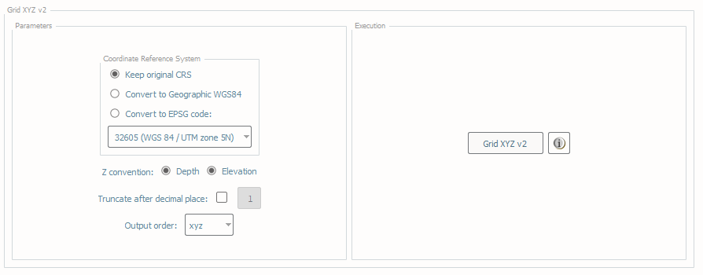

.. _grid-xyz-label:

Grid xyz
--------

.. index::
    single: grid xyz

How To Use?
^^^^^^^^^^^

Export elevation values as a point cloud.

* Select the **Grid xyz** tab on the bottom of the QC Tools interface.

* Choose the coordinate reference system that the user would like the file to be exported. The user may keep the **original coordinate reference system**, convert to **Geographic WGS84**, or convert to a specific **EPSG code** using the radio buttons. 

* Choose the Z convention of either **Depth** (positive down) or **Elevation** (positive up). 

* The user optionally can choose to truncate the depth after a specific decimal place.

* The user may also choose the output order of the latitude/northing, longitude/easting, and depth/elevation to suit their needs.

* In **Execution** (:numref:`fig_grid_xyz`), click **Grid XYZ v2**.

.. _fig_grid_xyz:

    Grid XYZ's interface.

* After computing, the output window opens automatically.

|

-----------------------------------------------------------

|

How Does It Work?
^^^^^^^^^^^^^^^^^

A text file with three columns is created.

