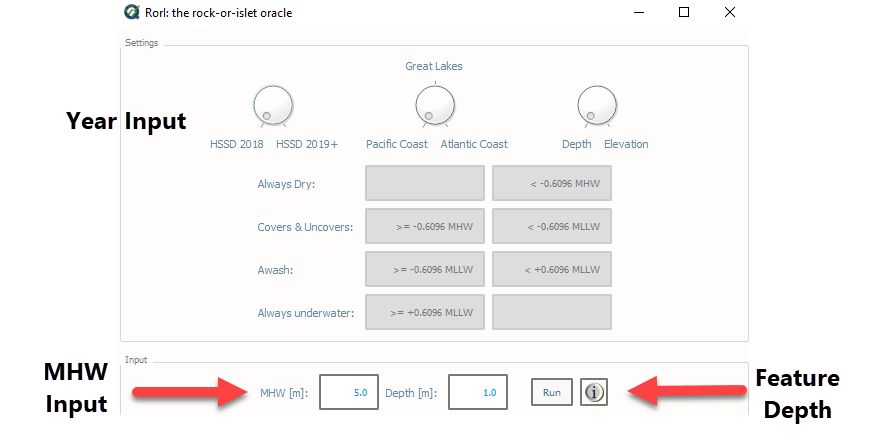

Info Tab
========

The Info Tab contains numerous helpful links and utilities:

	* The HydrOffice QC Tools website
	* The Online User Manual
	* The Offline User Manual (PDF)
	* A User Bug Report Tool
	* The HydroOffice Main Page 
	* The NOAA Nautical Charts Home Page
	* The Center for Coastal and Ocean Mapping Main Page
	* The University of New Hampshire Main Page

	* Uncertainty Calculator
	* The Rock or Islet oracle
	* `NOAA S-57 Support Files for CARIS <https://www.hydroffice.org/manuals/abc/user_manual_info.html#noaa-s-57-support-files-for-caris>`_
	* License Information
	* Contacts List
	* QC Tools Software Information 

.. image:: _static/info_tab_full.png
    :align: center
    :alt: logo

|

-----------------------------------------------------------

|

RorI: Your Rock-or-Islet Oracle
^^^^^^^^^^^^^^^^^^^^^^^^^^^^^^^
|

How To Use?
"""""""""""

|

**RorI** has been created as a tool to help hydrographers determine if their feature is a rock or an islet. RorI is a standalone
tool that is launched from the button at the top of the Info tab.

|

.. image:: _static/info_tab_rori.png
    :align: center
    :alt: logo

|

.. image:: _static/info_tab_rori_gui.png
    :align: center
    :alt: logo

|

How Does It Work?
"""""""""""""""""

|

At the top of RorI there are two toggles. How rocks and islets are defined depends upon where you are surveying due to
the tidal range that occurs in these areas. NOAA has three discrete regions: The East Coast (including the Gulf Coast),
the West Coast (including Alaska), and the Great Lakes. The user will set the first toggle depending on the location of
their survey.

The second toggle does not have an impact on how RorI is doing its calculations. The toggle controls two visualizations.
First, the boxes below which show you the math being used to define the different WATLEV values. You can either view
these values in an elevation (positive up) or depth (positive down). The boxes below show the math behind of each WATLEV
value which are derived from NOAA's 2017 Hydrographic Specifications and Deliverables.

|

|

The user will then enter two very important pieces of information: the MHW value and the depth of the feature. The hydrographer
will retrieve the MHW value from their tide note. The feature shall be tidally corrected and be referenced to MLLW. That
means all depths above MLLW shall be negative! Note for the Great Lakes, all data is referenced to LWD, therefore there
is no input needed by the user.

Next, RorI will crunch the numbers and tell you if your feature is a rock or islet. If it is a rock, it will
let you know its depth (VALSOU) and water level effect (WATLEV). If your feature is an islet, it will reference the elevation
(ELEVAT) to MHW (LWD for the Great Lakes).

RorI does not use magic to calculate the difference between a rock or and islet. What it does is some simple math. The tool
compares the depth to the MHW value (or LWD for the Great Lakes) which are both entered by the user. If the rock is higher in elevation than the following values,
then it is an islet.

    * Atlantic Coast: 0.3048 m
    * Pacific Coast: 0.6096 m
    * Great Lakes: 1.2192 m

|

.. image:: _static/info_tab_rori_outputs.png
    :align: center
    :alt: logo

|

RorI also helps the hydrographer visualize the difference between a rock and an islet for their survey using a graphic.

|

-----------------------------------------------------------

|

Uncertainty Calculator
^^^^^^^^^^^^^^^^^^^^^^

|

How To Use?
"""""""""""
|

**Uncertainty Calculator** is a standalone tool to help you calculate the total vertical uncertainty and total horizontal
uncertainty of hydrographic data.

To launch the tool, click the button at the top of the Info tab.

.. image:: _static/info_tab_uncertainty_calculator.png
    :align: center
    :alt: logo

The user can toggle between Special Order, Order 1, and Order 2 requirements.

The user inputs the depth and displayed below are the results of both the IHO and NOAA Specifications.

|

.. image:: _static/info_tab_uncertainty_calculator_gui.png
    :align: center
    :alt: logo

|

-----------------------------------------------------------

|

How Does It Work?
"""""""""""""""""
|

* IHO and NOAA TVU calculations are identical per S-44 and the Hydrographic Survey Specifications and Deliverables.

.. math::

    TVU\, QC = Uncertainty / \sqrt{a^2 + (b * depth)^2}

where :math:`a = 0.25m, b = 0.0075 m` for Special Order, :math:`a = 0.5, b = 0.013` for Order 1 (depths less than 100 m), and :math:`a = 1.0, b = 0.023` for Order 2 (depths greater than 100 m).

* IHO and NOAA THU utilize the same formula but with different variables.

.. math::

    THU\, QC = ±(k+p x depth)

where:

    IHO:
        * Special Order: where :math:`k = 2 m, p = 0 pct`
        * Order 1: where :math:`k = 5 m, p = 5 pct`
        * Order 2: where :math:`k = 20 m, p = 10 pct`
    NOAA:
        * All Orders: where :math:`k = 5 m, p = 5 pct`

* The graph at the bottom of the tool is interactive and visually represents the total vertical and total horizontal
  uncertainties at that order.

