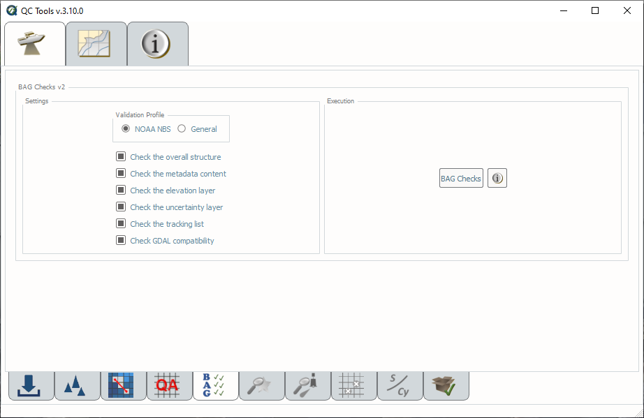

.. _survey-bag-checks:

BAG Checks
----------

.. index::
    single: bag checks

How To Use?
^^^^^^^^^^^    
    
Evaluates BAGs to ensure compliance with NOAA NBS and BAG specification requirements.

In order to access this tool, load in a BAG file into the **Data Inputs** tab.

* Select the **BAG Checks** tab (:numref:`fig_bag_checks`) on the bottom of the QC Tools interface.

* Check the boxes that correspond with the checks you wish to perform.

* In **Execution**, click **BAG Checks v1**.

.. _fig_bag_checks:

    The **BAG Checks** tab.

|

-----------------------------------------------------------

|

How Does It Work?
^^^^^^^^^^^^^^^^^

The BAG files are inspected to ensure compliance with NOAA NBS requirements and BAG Format Specification Documents.

**Check the overall structure**: Check that the critical components of BAG structure are present.
    * BAG Root group
    * BAG Version attribute
    * Metadata dataset
    * Elevation dataset
    * Uncertainty dataset
    * Tracking List dataset
    * For VR Surfaces:
        * VR Metadata dataset
        * VR Refinements dataset
        * VR Tracking List dataset

**Check the metadata content**: Checks to ensure that metadata associated with the BAG are appropriately attributed. Checks for the presence of the following:
    * Metadata dataset 
    * VR Metadata dataset (VR only)
    * For NOAA NBS Profile:
        * Spatial reference system is projected.
        * Vertical datum is defined.
        * Creation date
        * Survey start date
        * Survey end date
        * Product Uncertainty

**Check the elevation layer**: Checks to ensure the validity of the elevation layer of BAG. Checks the following:
    * For the presence of a Elevation dataset 
    * All depth values are not NaN
    * VR Refinements (VR only)

**Check the uncertainty layer**: Checks to ensure the validity of the uncertainty layer in the BAG. Checks the following:
    * For the presence of an Uncertainty dataset
    * All values are not NaN
    * Uncertainty values are only positive
    * VR Refinements (VR only)
    * For NOAA NBS Profile:
        * Uncertainty values are not too high [1]_

**Check the tracking list**: Checks to ensure the validity of the tracking list. Checks the following:
    * For the presence of the Tracking List dataset and the VR Tracking List dataset (VR only)
    * Validity of the entries in the 'row' column
    * Validity of the entries in the 'col' column

**Check GDAL Compatibility**: Checks to ensure that the surface is compatible with GDAL. Checks the following:
    * Checks that that the grid does not have more than 10,000,000 refinement grids which will result in a GDAL error

.. rubric:: Footnotes

.. [1] High uncertainty is calculated as 4.0m + 0.1 * maximum depth of the surface.

|

-----------------------------------------------------------

|

What do you get?
^^^^^^^^^^^^^^^^^

Upon completion of the execution of **BAG Checks** you will receive a pop-up verification "pass" if your surface passes all the checks, or "fail" if your surface fails any one check (:numref:`fig_bag_checks_output`).

.. _fig_bag_checks_output:

    The **BAG Checks** pop-up output.

**BAG Checks** produces a PDF report that indicates what checks were performed and the results of the checks (:numref:`fig_bag_checks_results`). At the end of the report a summary indicates how many warnings and errors were identified for the surface (:numref:`fig_bag_checks_summary`).

.. _fig_bag_checks_results:

    An example of a **BAG Checks** PDF report.

.. _fig_bag_checks_summary:

    An example of the **BAG Checks** summary.
