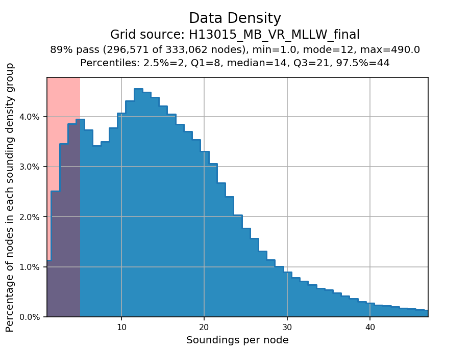

.. _survey-grid-qa:

Grid QA
-------

.. index::
    single: grid qa

How To Use?
^^^^^^^^^^^    
    
Computes grid statistics to ensure compliance with uncertainty and density requirements.

* Select the **Grid QA** tab (:numref:`fig_grid_qa`) on the bottom of the QC Tools interface.

.. index::
    single: grid qa; coverage

* Check the boxes that correspond with the plots you wish to generate. 

.. index::
    single: grid, uncertainty, density

* In **Execution**, click **Grid QA v6**.

.. _fig_grid_qa:

    The **Grid QA** tab.

* After computing, the output window opens automatically, and the results are shown (:numref:`fig_grid_qa_output`).

.. _fig_grid_qa_output:
.. figure:: _static/grid_qa_results.png
    :width: 250px
    :align: center
    :alt: fliers tab
    :figclass: align-center

    The output message at the end of **Grid QA v5** execution.

* From the output window, view each plot to assess the grid compliance to uncertainty and density specifications.

.. note::
    The **Plot depth vs. density** and **Plot depth vs. TVU QC** can potentially require a large amount of memory
    (i.e., when the input grid contains hundreds of millions of nodes). As such, both plots are unflagged by default.
    You can flag them if you need their output. If having both plots selected triggers a memory error,
    you may try to flag these plots once at a time.

|

-----------------------------------------------------------

|

How Does It Work?
^^^^^^^^^^^^^^^^^

The Depth, Uncertainty, Density (if available), and a computed Total Vertical Uncertainty (TVU) QC layer are used to compute particular statistics shown as a series of plots.  

**The following plots are the output of Grid QA:**
    * The Depth layer is plotted as a distribution (plot entitled **"Depth Distribution"**).
    
    * The Density layer is plotted as a distribution (plot entitled **"Data Density"**).

        * Percentages of nodes less than 5 soundings per node fall in the red shaded region of the plot and together must be less than 5% of all nodes in order to "pass".

    * TVU QC (IHO S-44) is plotted as a distribution (plot entitled **"Uncertainty Standards - NOAA HSSD"**).

        * Percentages of nodes with TVU QC greater than 1.0 (indicating that the allowable error has been exceeded) fall in the red shaded region of the plot, and together must be less than 5% of all nodes in order to "pass".

    * Only for Variable Resolution grids, a histogram with the percentage of nodes at the prescribed resolution is created. This histogram can be used to evaluate whether *"95% of all surface nodes [..] have a resolution equal to or smaller than the coarsest allowable resolution for the node depth"* (NOAA HSSD).

    * *TVU QC (IHO S-57 CATZOC) [Branch]* is plotted as a distribution (plot entitled *"Uncertainty Standards - CATZOC ..."*).

    * Density is plotted against the corresponding Depth of the node (plot entitled **"Node Depth vs. Sounding Density"**).
        
    * TVU QC (IHO S-44) is plotted against the corresponding Depth of the node (plot entitled **"Node Depth vs. TVU QC"**).

|

**TVU QC Calculations**

The TVU QC layer is calculated on-the-fly by the program. TVU QC based on IHO S-44 Orders 1 and 2 is in alignment with the requirements set forth by the HSSD and is determined by a ratio of uncertainty to allowable error. It is calculated as such:  

.. math::

    TVU\, QC _{(IHO\hspace{1mm} S\textendash 44)} = Uncertainty / \sqrt{A^2 + (B * Depth)^2}

where :math:`A = 0.5, B = 0.013` for Order 1 (depths less than 100 m), and :math:`A = 1.0, B = 0.023` for Order 2 (depths greater than 100 m).

TVU QC based on IHO S-57 CATZOC is used by the hydrographic branch to evaluate the quality of bathymetry for surveys that are not subject to the HSSD. **This check should NOT be used by NOAA field units or contract field units.**

For TVU QC based on IHO S-57 CATZOC, TVU QC is calculated as such:

.. math::

    TVU\, QC _{(IHO\hspace{1mm} S\textendash 57\hspace{1mm} CATZOC)} = Uncertainty / (A + (B * Depth))

where for:

    *CATZOC A1:* :math:`A = 0.5, B = 0.01`

    *CATZOC A2 and CATZOC B:* :math:`A = 1.0, B = 0.02`

    *CATZOC C:* :math:`A = 2.0, B = 0.05`

|

-----------------------------------------------------------

|

What do you get?
^^^^^^^^^^^^^^^^^

Upon completion of the execution of **Grid QA** you will receive a pop-up verification if your statistics are complete (:numref:`fig_grid_qa_pop_up`).

.. _fig_grid_qa_pop_up:

    The output message at the end of **Grid QA** execution.

**Grid QA** produces images representing specific statistical analysis:

* Depth Distribution (:numref:`fig_grid_qa_depth`).
* Data Density (:numref:`fig_grid_qa_density`).
* Uncertainty Standards - NOAA HSSD (:numref:`fig_grid_qa_uncertainty`) and CATZOC (:numref:`fig_grid_qa_catzoc`).
* Resolution Requirements *(only for VR grids)* (:numref:`fig_grid_qa_resolution`).
* Node Depth vs. Sounding Density (:numref:`fig_grid_qa_depth_vs_density`).
* Node Depth vs. TVU QC (:numref:`fig_grid_qa_depth_vs_tvu`).

.. _fig_grid_qa_depth:

    A histogram of the percentage of total nodes at each depth represented in the surface.

.. _fig_grid_qa_density:

    A histogram of the percentage of total nodes that contain a specific sounding per node. To pass a node must have at least 5 soundings contributing to the population of that node.

.. _fig_grid_qa_uncertainty:

    A histogram of the percentage of total nodes that contain a node uncertainty as a fraction of the IHO TVU. Anything over 1.0 does not pass uncertainty requirements.

.. _fig_grid_qa_resolution:

    A histogram, created only for VR surfaces, that shows the percentage of nodes that have a node resolution as a fraction of the allowable resolution at that depth. Anything over 1.0 does not pass uncertainty requirements.

.. _fig_grid_qa_depth_vs_density:

    A plot of every node represented in the surface in plotted as its depth on the y axis and its density on the x axis.

.. _fig_grid_qa_depth_vs_tvu:

    A plot of every node represented in the surface in plotted as its depth on the y axis and its uncertainty as a fraction of the IHO TVU on the x axis.

.. _fig_grid_qa_catzoc:

    Similar to the uncertainty plot, the CATZOC uncertainty shows a histogram of the percentage of total nodes that contain a node uncertainty as a fraction of the specific CATZOC TVU value. Anything over 1.0 does not pass the requirements.

