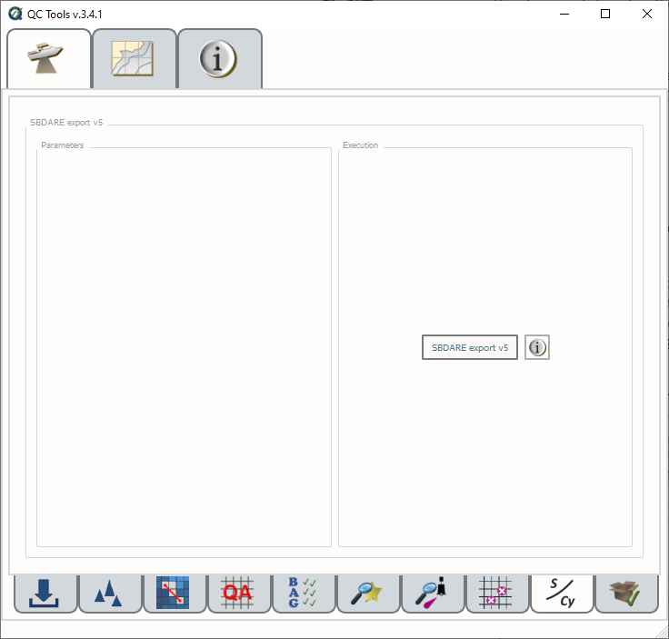
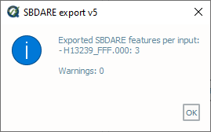

.. _survey-sbdare-export:

SBDARE export
-------------

Generates a text file and shapefile for archival that includes, if available, linked bottom sample images and a translation
of the S-57 attribution to the Coastal and Marine Ecological Classification Standard (CMECS).

In order to access this tool, load a grid and an S-57 file into the **Data Inputs** tab. 

.. index::
    single: SBDARE export

How to Use?
^^^^^^^^^^^

* Select the **SBDARE export** tab on the bottom of the QC Tools interface.

* In **Parameters**:

  * Turn the knob to select applicable HTD.

  * If HTD 2018-4 is selected, you may set the images folder path by checking set **Select the path to the images folder** option. If unset, the default search is in the input feature file folder.

  * Flag **Set the EXIF GPS in JPEG image to S57 position** to include or overwrite the location of the bottom sample in the image metadata based on the S-57 feature file.

* Click **SBDARE export v4** (:numref:`sbdare_export_interface`).

.. _sbdare_export_interface:

    SBDARE export's interface.

* After computing, the output window opens automatically, and the results are shown. Any errors that occur while processing will appear in the output message. (:numref:`sbdare_results`):

.. _sbdare_results:

    SBDARE export's output message.

* The output is in the proper format for archival.

