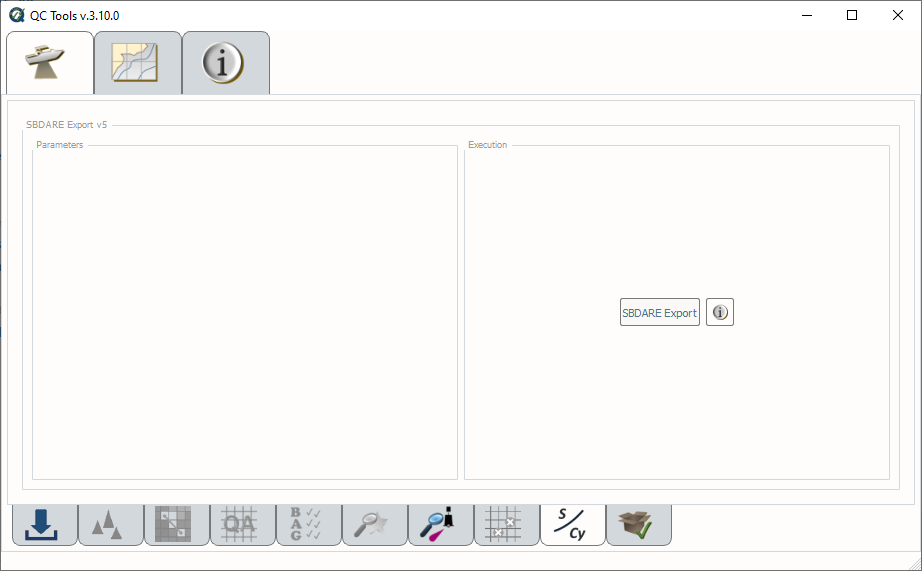

.. _survey-sbdare-export:

SBDARE export
-------------

Generates a text file and shape file for archival that includes, if available, linked bottom sample images and a translation
of the S-57 attribution to the Coastal and Marine Ecological Classification Standard (CMECS).

In order to access this tool, load a grid and an S-57 file into the **Data Inputs** tab. 

.. index::
    single: SBDARE export

How to Use?
^^^^^^^^^^^

* Select the **SBDARE export** tab on the bottom of the QC Tools interface.

* Click **SBDARE export v5** (:numref:`sbdare_export_interface`).

* A window will appear requesting the user to identify the path to the images. If your bottom samples do not contain images you may select "Cancel".

.. _sbdare_export_interface:

    SBDARE exports interface.

* After computing, the output window opens automatically, and the results are shown. Any errors that occur while processing will appear in the output message. (:numref:`sbdare_results`):

.. _sbdare_results:

    SBDARE exports output message.

* The output positions are in **WGS84 coordinates**.

* The output is in the proper format for archival.

|

-----------------------------------------------------------

|

How Does It Work?
^^^^^^^^^^^^^^^^^

SBDARE export selects only SBDARE point features in the feature file and exports them into the appropriate outputs per the Bottom Samples and CMECS Translation for submittal to NCEI SOP. 

Both the semicolon delimited ASCII file and the shape file contain the following information: Latitude, Longitude, Colour, Nature of surface - qualifying terms, Nature of surface, Remarks, Source date, Source indication, Images, CMECS Co-occurring Element 1 Name, and CMECS Co-occurring Element 1 Code, CMECS Co-occurring Element 2 Name, and CMECS Co-occurring Element 2 Code.

**Colour**, **Nature of surface - qualifying terms** (NATSUR), and **Nature of surface** (NATQUA) are all limited to three or fewer terms. If the feature file contains more than three terms per attribute, the first three are selected. Additionally, only a maximum of four **images** are allowed per feature. If there are more than four images for a feature, the first four are selected for export. 

All associated images will have the GPS metadata in the JPEG file match the location of the bottom sample in the feature file. This allows future users to utilize these images in GIS software as they are geotagged. 

SBDARE export translates the **NATSUR** and **NATQUA** to the appropriate Coastal and Marine Ecological Classification Standard June 2012 (**CMECS**) standard. A crosswalk table used for this classification can be found in the Bottom Samples and CMECS Translation for submittal to NCEI SOP. 

A zip file is created containing the shape file and "Images" folder with the images. If no images are available, a text file is created indication that the image folder is intentionally left empty.

|

-----------------------------------------------------------

|

What do you get?
^^^^^^^^^^^^^^^^^

Upon completion of the execution of **SBDARE Export** you will receive a pop-up about the number of bottom samples that were exported.
The number of warnings associated with the output are also provided (:numref:`fig_sbdare_pop_up_results`).

.. _fig_sbdare_pop_up_results:

    The output message at the end of **SBDARE export v5** execution.

**SBDARE export v5** produces an ASCII file or a zip file, containing a shapefile with bottom sample locations and an images folder with georeferenced images (:numref:`fig_sbdare_export_shapefile`), for NCEI archival.
Attributes includes NOAA S-57 attribution and CMECS translations.

.. _fig_sbdare_export_shapefile:

    Bottom samples shown as red circles with an ENC in the background.

