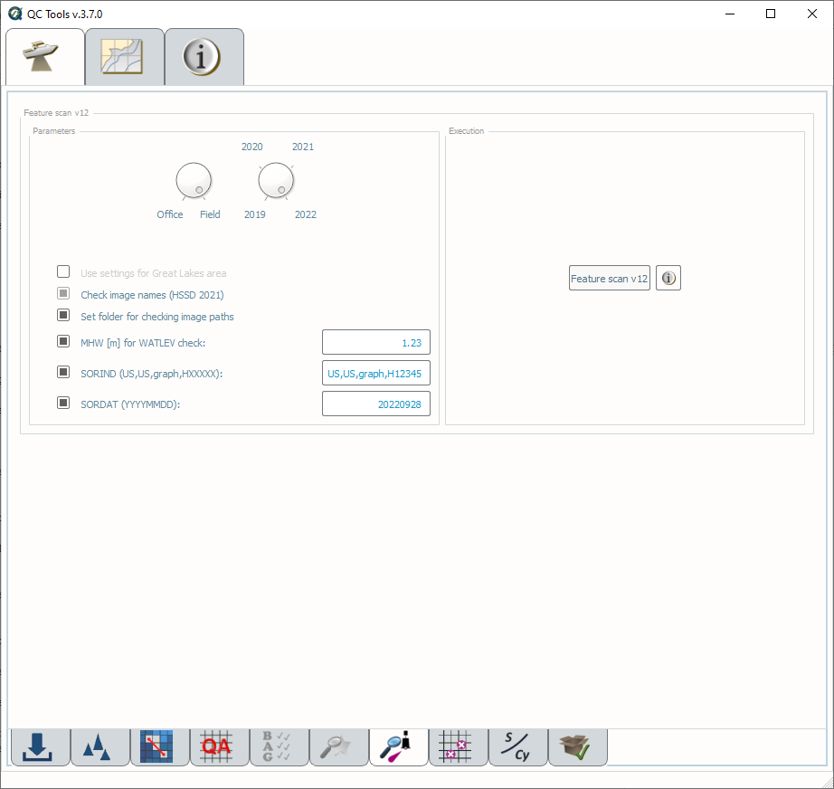
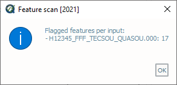
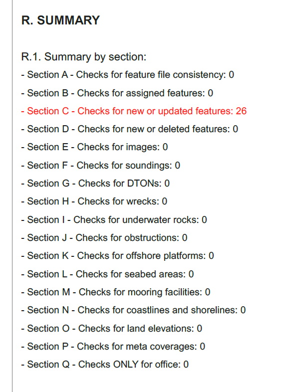

.. _survey-scan-features:

Scan features
-------------

.. index::
    single: features

How To Use?
^^^^^^^^^^^

Scan features to ensure proper attribution.

In order to access this tool, load an S-57 file into the **Data Inputs** tab. 

* Select the **Scan features** tab (:numref:`fig_feature_scan`) on the bottom of the QC Tools interface.

* In **Parameters**:

  #. Turn the knob to select either the **Office** or **Field** profile.

  #. Turn the knob to select the applicable year as pertaining to required HSSD.

  #. Select **Use settings for Great Lakes area** if your survey is located in the Great Lakes region. This functionality is used when analyzing the WATLEV of features.  

  #. When **Check Image Names** is set, the tool will check image names for compliance with the HSSD or with HTD 2018-4 (SBDARE features) and HTD 2018-5 (non-SBDARE features), depending on the year selected. This check can only be disabled in the Field mode for 2019. In Office mode, the HTD or HSSD checks automatically run. 
  
  #. When **Select the path to the images folder** is set, the user can navigate to their multimedia or images folder upon execution of the tool. When this is unchecked, Feature scan will search in the relative path that the feature file is located.

  #. **MHW** value is required to check proper attribution of WATLEV per the HSSD. Enter MHW value as a positive number.

  #. When **SORIND** and **SORDAT** are set, the entered values are compared to the attribution of new and updated features.

.. index::
    single: feature scan

* In **Execution**, click **Feature scan v12**.

.. _fig_feature_scan:

    The **Scan features** tab.

* After computing, the output window opens automatically, the results are shown(:numref:`fig_feature_scan_output`).

.. _fig_feature_scan_output:

    The output message at the end of **Feature scan** execution.

* From the output window, drag-and-drop the output file(s) into the processing software to guide the review.

* In addition, the results are printed to PDF for a documented summary.

|

-----------------------------------------------------------

|

How Does It Work?
^^^^^^^^^^^^^^^^^

The S-57 features are scanned to ensure proper attribution per the required year of HSSD.

The logic for the 2022 QC Tools feature scan is shown below. For previous years, refer to the HSSD for that year.

* Checks for feature file consistency:
	* Check to ensure no feature redundancy. Features that have the same position, acronym, and attribution are flagged.
	* No features with text input fields exceeds 255 characters.
* Assigned features = all features with **asgnmt = 2**:
    * All Assigned features must have **descrp** and **remrks.**	
* All new and updated features except **$AREAS, $LINES, $CSYMB, $COMPS,** and **$TEXTS**:
    * Must have **SORIND** and **SORDAT** and that they are in the proper formats.
    * Check for agreement of **SORIND** and **SORDAT** values when entered in the Parameters.
	* If MHW flag is set, features with **VALSOU** are checked for valid value and proper **WATLEV** attribution. [1]_
	* All new or updated features with a VALSOU have a correct **QUASOU** per the HSSD. [2]_
	* All features with **ELEVAT** are checked for valid value.
* New or Deleted features = all features with **descrp = 1 or 3**:
    * All New or Deleted features must have **remrks**.
* All features with images:
	* All **images** contain the correct naming convention and they have a corresponding image in the multimedia folder.
	* Receive a warning if an image is used on multiple features.
* Sounding features = all **SOUNDG.**
    * All Sounding features must have **TECSOU** and **QUASOU.**
* DTONs = all features with **descrp = 1 or 2**, **sftype = 3**:
    * All DTONs must have **images.**
* Wrecks = all **WRECKS** with **descrp = 1 or 2**:
    * All Wrecks must have **images, CATWRK**, and **VALSOU** or **HEIGHT**. [3]_
	* If Wreck has **VALSOU**:
		* Must have **WATLEV**, **QUASOU**, and **TECSOU**.
    * If Wreck has **HEIGHT**:
        * Must have **WATLEV** = "Always Dry"
        * **TECSOU** and **QUASOU** should be blank.
	* If Wreck does not have **VALSOU**:
		* Must have **QUASOU** and **TECSOU** of null/undefined.
		* Receive a warning if **WATLEV** is not "unknown".
* Rocks = all **UWTROC** with **descrp = 1 or 2**:
    * All Rocks must have **VALSOU**. [3]_
	* If Rock has **VALSOU**:
		* Must have **WATLEV**, **QUASOU**, and **TECSOU**.
	* If Rock does not have **VALSOU**:
		* Must have **QUASOU** and **TECSOU** of null/undefined.
		* Receive a warning if **WATLEV** is not "unknown".
* Obstructions = all **OBSTRN** with **descrp = 1 or 2**:
    * All Obstructions (excluding foul areas) must have **images**.
    * All obsructions (excluding foul ground and foul areas) must have **VALSOU**. [3]_
    * If obstruction has **VALSOU**:
        * Obstruction must have **WATLEV**, **QUASOU**, and **TECSOU**.
    * If obstruction has **HEIGHT**:
        * Must have **WATLEV** = "Always Dry"
        * **TECSOU** and **QUASOU** should be blank.
    * If obstruction does not have **VALSOU** or **HEIGHT**:
        * Must have **QUASOU** and **TECSOU** of null/undefined.
        * Receive a warning if **WATLEV** is not "unknown".
    * If obstruction is foul ground:
        * Must have **WATLEV**.
        * Must have **VALSOU**, **QUASOU**, and **TECSOU** of null/undefined.
    * If obstruction is a foul area:
        * Must not have **VALSOU** populated.
        * Receive a warning if **WATLEV** is not "unknown".
        * **QUASOU** must be "depth unknown".
        * Must have **TECSOU** of "unknown".
* Offshore platforms = all **OFSPLF** with **descrp = 1 or 2**:
    * All Offshore platforms must have **images.**
* Seabed areas:
	* Seabed area lines and areas = all **SBDARE** with **line** or **area** geometry.
		* All Seabed area lines and areas must have **NATSUR** and **WATLEV.**
	* Seabed area points = all **SBDARE** with **point** geometry.
		* All Seabed area points must have **NATSUR.**
		* All Seabed area points must have as many **NATSUR** attributes as **NATQUA** and/or **COLOUR.**
		* All Seabed area points must have an allowable combination of **NATSUR** and **NATQUA.** [4]_
* Mooring Facilities
	* All MORFAC must have **CATMOR**.
* Coast lines and shorelines:
	* All **COALNE** must have **CATCOA.**
	* All **SLCONS** must have **CATSLC.**
* Land elevations:
	* All **LNDELV** must have **ELEVAT.**
* Metadata coverages:
	* All **M_COVR** must have **CATCOV, INFORM,** and **NINFOM.**
* Specific for the Office Profile:
    * All features must have **onotes.**
    * All features must have **hsdrec.**
    * Checks for features that are prohibited by MCD (**DRGARE, LOGPON, PIPARE, PIPOHD, PIPSOL, DMPGRD, CBLSUB, CBLARE, FAIRWY, CBLOHD, BCNSPP, BRIDGE, OBSTRN with CATOBS = 5**, and **MORFAC** with **CATMOR = 7**.
    * Flags ATONS if they are found in the file. MCD defines ATONS as: **LIGHTS, BOYLAT, BOYSAW, BOYSPP, DAYMAR, FOGSIG, RTPBCN, BOYISD, BOYINB, BOYCAR, BCNSPP, BCNLAT, BCNSAW, BCNCAR**, and **BCNISD**
    * All new/updated **M_QUAL** features must have **CATZOC, SURSTA, SUREND,** and **TECSOU.**
    * All features must have **descrp** and **remrks**.
    * No features with onotes text input field exceeding 250 characters.

.. rubric:: Footnotes

.. [1] Allowable combinations of **WATLEV** per **VALSOU** depending on location are shown below as stated in Appendix E in the 2022 Hydrographic Specifications and Deliverables.

.. _fig_WATLEV_attribution:

	
.. [2] Allowable combinations of **TECSOU** and **QUASOU** are shown below.

+------------+---+---+---+---+---+---+---+---+---+---+---+---+---+---+
|**TECSOU**  | 1 | 2 | 3 | 4 | 5 | 6 | 7 | 8 | 9 | 10| 11| 12| 13| 14|
+-----+------+---+---+---+---+---+---+---+---+---+---+---+---+---+---+
|     |   1  |   |   |   |   |   |   |   |   |   |   |   |   |   |   |
+**Q**+------+---+---+---+---+---+---+---+---+---+---+---+---+---+---+
|     |   2  |   |   |   |   |   |   |   |   |   |   |   |   |   |   |
+**U**+------+---+---+---+---+---+---+---+---+---+---+---+---+---+---+
|     |   6  |   |   | o | o |   | o |   |   |   |   |   | o |   |   |
+**A**+------+---+---+---+---+---+---+---+---+---+---+---+---+---+---+
|     |   7  |   |   |   |   |   |   |   |   |   |   |   |   |   |   |
+**S**+------+---+---+---+---+---+---+---+---+---+---+---+---+---+---+
|     |   8  |   |   |   |   |   |   |   |   |   |   |   |   |   |   |
+**O**+------+---+---+---+---+---+---+---+---+---+---+---+---+---+---+
|     |   9  |   | o |   |   |   |   |   |   |   |   |   |   |   |   |
+**U**+------+---+---+---+---+---+---+---+---+---+---+---+---+---+---+
|     | NULL | o |   |   |   |   |   | o |   |   | o |   |   |   |   |
+-----+------+---+---+---+---+---+---+---+---+---+---+---+---+---+---+

**TECSOU**: found by echosounder (1), found by side scan sonar (2), found by multibeam (3), found by diver (4), found by leadline (5), swept by wire-drag (6), found by laser (7), swept by vertical acoustic system (8), found by electromagnetic sensor (9), photogrammetry (10), satellite imagery (11), found by levelling (12), swept by side-scan sonar (13), and computer generated (14).

**QUASOU**: depth known (1), depth or least depth "unknown" (2), least depth known (6), least depth "unknown", safe clearance at value shown (7), value reported (not surveyed) (8), value reported (not confirmed) (9), and NULL (undefined/blank).

.. [3] **VALSOU** is optional for rocks, wrecks, and obstructions if it is unsafe to obtain the least depth. If missing a warning flag is issued.

.. [4] Allowable combinations of **NATSUR** and **NATQUA** are shown below.

+----------+---+---+---+---+---+---+---+---+---+---+
|**NATQUA**| 1 | 2 | 3 | 4 | 5 | 6 | 7 | 8 | 9 | 10|
+-----+----+---+---+---+---+---+---+---+---+---+---+
|     |  1 |   |   |   |   | o | o | o | o | o | o |
+     +----+---+---+---+---+---+---+---+---+---+---+
|     |  2 |   |   |   |   | o | o | o |   |   | o |
+     +----+---+---+---+---+---+---+---+---+---+---+
|     |  3 |   |   |   |   | o | o | o |   |   | o |
+     +----+---+---+---+---+---+---+---+---+---+---+
|**N**|  4 | o | o | o |   |   | o |   | o | o | o |
+     +----+---+---+---+---+---+---+---+---+---+---+
|**A**|  5 |   |   |   |   |   |   |   | o | o |   |
+     +----+---+---+---+---+---+---+---+---+---+---+
|**T**|  6 |   |   |   |   |   |   |   | o | o |   |
+     +----+---+---+---+---+---+---+---+---+---+---+
|**S**|  7 |   |   |   |   |   |   |   | o | o |   |
+     +----+---+---+---+---+---+---+---+---+---+---+
|**U**|  8 |   |   |   |   |   |   |   | o | o |   |
+     +----+---+---+---+---+---+---+---+---+---+---+
|**R**|  9 |   |   |   |   |   |   |   | o | o |   |
+     +----+---+---+---+---+---+---+---+---+---+---+
|     | 11 |   |   |   |   |   |   |   | o |   |   |
+     +----+---+---+---+---+---+---+---+---+---+---+
|     | 14 |   |   |   | o |   |   |   |   |   |   |
+     +----+---+---+---+---+---+---+---+---+---+---+
|     | 17 |   |   |   | o |   |   |   |   | o |   |
+     +----+---+---+---+---+---+---+---+---+---+---+
|     | 18 |   |   |   |   |   |   |   | o | o |   |
+-----+----+---+---+---+---+---+---+---+---+---+---+

**NATQUA**: fine (1), medium (2), coarse(3), broken (4), sticky (5) soft (6), stiff (7), volcanic (8), calcareous (9), hard (10)

**NATSUR**: mud (1), clay (2), silt (3), sand (4), stone (5), gravel (6), pebbles (7), cobbles (8), rock (9), lava (11), coral (14), shells (17), boulder (18)

-----------------------------------------------------------

|

What do you get?
^^^^^^^^^^^^^^^^^

Upon completion of the execution of **Feature Scan** you will receive a pop-up verification if your surface contains potential fliers or not (:numref:`fig_feature_scan_pop_up`).

.. _fig_feature_scan_pop_up:

    The **Feature Scan** output message.

**Feature Scan** produces a .000 files containing "blue notes" which helps the user identify the locations flagged features.
Each test that results in a flag will have a corresponding feature in the output file.
The **NINFOM** field is used to describe the warning or error associated with the feature.
The **INFORM** field contains the corresponding test number from the PDF Report (:numref:`fig_feature_scan_bluenotes_fields`).
These can be loaded into your GIS software of choice for further analysis.

.. _fig_feature_scan_bluenotes:

    An example of a warning associated with an obstruction identified with a blue note ($CSYMB).

.. _fig_feature_scan_bluenotes_fields:

    An example of one feature with multiple flags. The "Information" field shows the corresponding section from the PDF Report,
    the "Information in national language" field shows a description of the flag.

**Feature Scan** produces a PDF report that indicates what checks were performed and the results of the checks (:numref:`fig_feature_scan_pdf_results`). At the end of the report, a summary indicates how many warnings and errors were identified grouped by type (:numref:`fig_feature_scan_summary`).

.. _fig_feature_scan_pdf_results:

    An example of a **Feature Scan** PDF report.

.. _fig_feature_scan_summary:

    An example of the **Feature Scan** summary.

