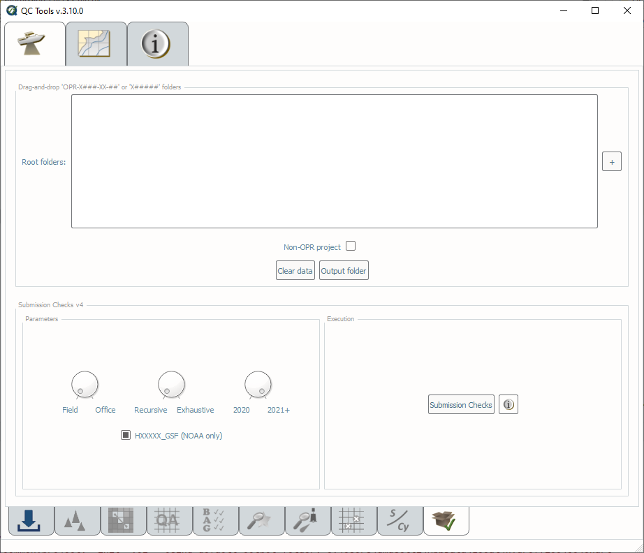
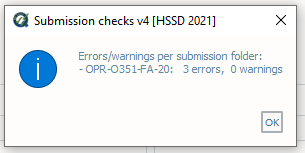
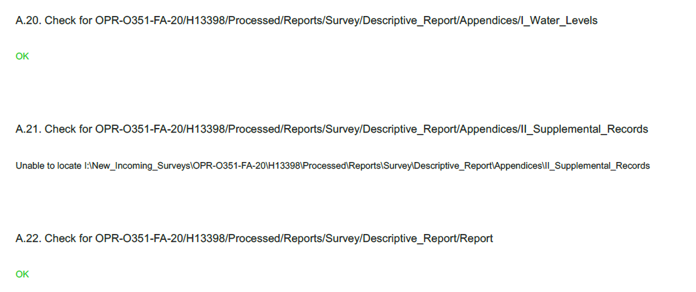
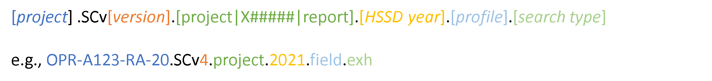

.. _survey-submission-checks:

Submission checks
-----------------

.. index::
    single: submission

How To Use?
^^^^^^^^^^^

Ensures the required directory structure and completeness of survey deliverables.

* Select the **Submission checks** tab on the bottom of the QC Tools interface.

.. index::
    single: submission checks

* Drag-and-drop (or browse **\"+\"** to) the directory to be examined. This can be at the survey level (**"X#####"**). Alternatively, the root folder may be at the project level (**"OPR-X###-XX-##"**), which will then examine all survey folders and project reports found within.
* Flag the **Non-OPR project** check if the submission survey folder does not start with **OPR-**.

* In **Parameters** (:numref:`submission_check_interface`, left side):

    * Turn the knob to select either the **Field** or **Office** profile.
    * Turn the knob to select either **Exhaustive** or **Recursive** settings. If an error is found, **Recursive** will stop at the level of the error; conversely, **Exhaustive** will continue to check sub-folders that are likely to perpetuate the error found at the higher level.
    * Turn the knob to select the applicable year as pertaining to required Hydrographic Survey Specifications.
    * Flag the **HXXXXX_GSF (NOAA only)** check if the submission is from a NOAA field unit.

* In **Execution** (:numref:`submission_check_interface`, rigth side), click **Submission checks v4**.

.. _submission_check_interface:

    The **Submission check** interface.

* After computing, the output window opens automatically, and the results are shown.

* Note that the project level (**"OPR-X###-XX-##"**) contains all the results from the surveys (**"X#####"**) contained within; thus the number of errors and warnings is equivalent to the sum of the individual components.

* The results are printed to PDF, one for each root folder.

* The output will be exported under a subfolder (**H#####**) in the output location defined on the data import tab.
  If "sub-folders" is selected in the import tab, the file will be placed in an additional "submissions" sub-folder
  within the survey folder.

|

-----------------------------------------------------------

|

How Does It Work?
^^^^^^^^^^^^^^^^^

Root folders have the following requirements: 

* A project root folder must be in the format of **"OPR-X###-XX-##"** or **"OPR-X###-XX-##_Locality_Name"** (unless the **Non-OPR project** check is on).

* A survey root folder must be in the format of **"X#####"** or **"X#####_Sublocality_Name"**.

* A project reports root folder must be in the format of **"Project_Reports"**.

The ensuing submission check will scan the directories of the root folders to ensure compliance with Appendix J of the HSSD.

The logic for the 2021 QC Tools submission check is shown below. For previous years, refer to the HSSD for that year.

* OPR-X###-XX-##
     * X##### [1]_
        * Raw
            * Features
            * MBES
            * SBES
            * SSS
            * SVP
            * WC
        * Processed
            * GNSS_Data
            * SBET
            * Multimedia
            * Reports
                * Project
                    * DAPR
                       * Report
                       * Appendices
                    * HVCR
                        * Digital_A-Vertical_Control_Report
                        * Digital_B-Horizontal_Control_Data
                            * ATON_Data
                            * Base_Station_Data
                    * Project_Correspondence
                * Survey
                    * Descriptive_Report
                        * Appendices
                            * I_Water_Levels
                            * II_Supplimental_Records
                    * Public_Relations_Constituent_Products
            * S-57_Files
                * Final_Feature_File
                * Side_Scan_Sonar_Contacts
            * Sonar_Data
                * HXXXXX_GSF [2]_
                * HXXXXX_HDCS [3]_
                    * HXXXXX_MB
                    * HXXXXX_SB
                    * HXXXXX_SSS
                    * HXXXXX_WC
                    * VesselConfig
                * HXXXXX_MB [4]_
                * HXXXXX_SB [4]_
                * HXXXXX_SSS [4]_
                * HXXXXX_WC [4]_
                * VesselConfig [4]_
            * SVP
            * Water_Levels

**Additional Checks:**

* An empty folder will be flagged as an error.

* No filepaths may exceed 200 (field) or 260 characters (office). 

.. rubric:: Footnotes

.. [1] Subfolders will not be checked if an error is found at this level (**Recursive** setting only).
.. [2] For NOAA only submissions.
.. [3] For submissions with CARIS projects.
.. [4] For submissions without CARIS projects.

|

-----------------------------------------------------------

|

What do you get?
^^^^^^^^^^^^^^^^^

Upon completion of the execution of **Submission checks** you will receive a pop-up verification that the tool has completed and if there were any errors or warnings associated with the data structure (:numref:`fig_submission_check_results`).

.. _fig_submission_check_results:

    The output message at the end of **Submission checks** execution.

**Submission checks** produces a PDF document that indicates if there were errors or warnings with specific folders in the data submission structures.

.. _fig_submission_check_output:

    An excerpt from the **Submission checks** pdf report.

The naming convention of the output files contains important information about the settings that were used to execute
Submission Checks.
Each setting is separated by a period in the naming convention.
See :numref:`fig_submission_checks_convention`.

.. _fig_submission_checks_convention:

    Example naming convention for a Submission Checks output. In this example the user selected a "include TECSOU = laser", "deconflict across grids" and Object Detection.
