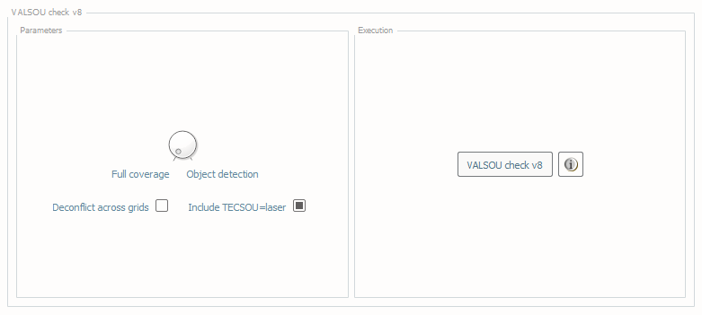
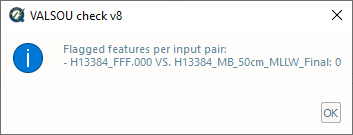
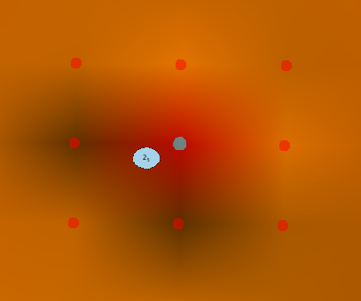
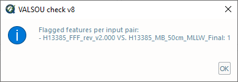
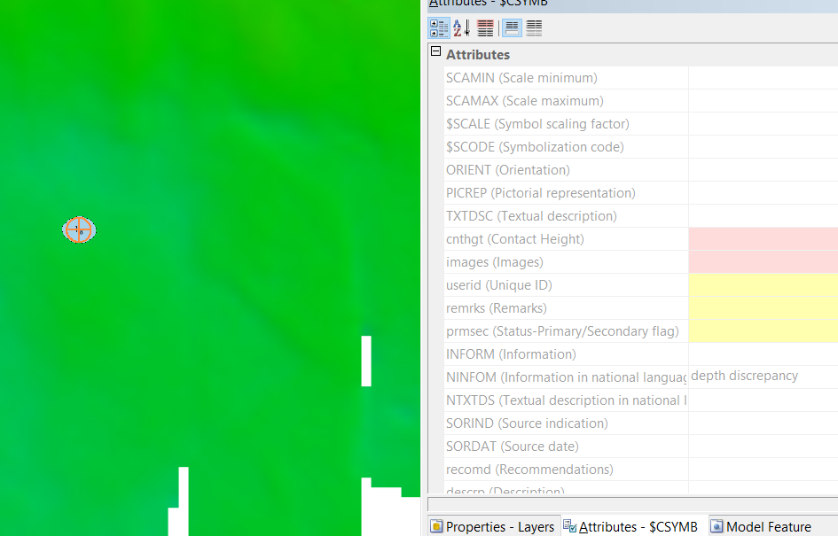

.. _survey-valsou-checks:

VALSOU Checks
-------------

.. index::
    single: VALSOU
    
How To Use?
^^^^^^^^^^^

Ensure surveyed features are properly accounted for in the gridded bathymetry.

In order to access this tool, load a grid and an S-57 file into the **Data Inputs** tab.

* Select the **VALSOU Check** tab (:numref:`fig_valsou_check`) on the bottom of the QC Tools interface.

.. index::
    single: VALSOU Checks

* In **Parameters**:

    * Turn the knob to select the survey mode: **Full coverage** or **Object detection**.
    * The **Deconflict across grids** checkbox may be enabled if the grids that are loaded have overlaps. If a feature has no grid data directly underneath, the nodes of the other grids in memory will be searched to find a valid match.
    * The **Include TECSOU=laser** checkbox may be enabled (in the event of lidar bathymetry wherein we'd expect features to be represented in the grid), or disabled (as in the case of shoreline investigations wherein we'd not have this expectation).

* In **Execution**, click **VALSOU Check v8**

.. _fig_valsou_check:

    The **VALSOU check** tab.

* After computing, the output window opens automatically, and the results are shown (:numref:`fig_valsou_check_output`).
  Note, the check considers all combination of grids and features files loaded. If there is no overlap found between a grid and feature file,
  no output is generated, and the summary will report "no overlap".

.. _fig_valsou_check_output:

    The output message at the end of **VALSOU Check v8** execution.

* From the output window, drag-and-drop the output into the processing software to guide the review.

* The output names adopt the following convention:

    * [grid].[s57].VCv8.[version].[".las" -> **Include TECSOU=laser**][".dec" -> deconfliction]["od"|"fc" -> mode]

.. note::
	**VR CSAR**: this tool may provide false positives due to current limitations in accessing designated soundings through the CARIS SDK.

.. note::
	**VR BAG**: this tool may provide false positives because grids created with CARIS apps do not currently contain the location of designated soundings.

|

-----------------------------------------------------------

|

How Does It Work?
^^^^^^^^^^^^^^^^^

The grid is scanned for features expected to be represented in the grid as per specification. These features are new or updated wrecks, rocks, and obstructions, and a grid node should be found that agrees with the feature VALSOU. 

For each feature, 9 grid node depths are selected: the grid node depth closest in position to the feature, and the 8 grid nodes surrounding it (:numref:`fig_valsou_check_nodes`). The minimum depth is selected from those 9 grid node depths, and that minimum depth must match the feature VALSOU (to centimeter precision). If not, a flag is raised. Note, this check not only ensures parity between feature VALSOUs and the grid, but it will also ensure the VALSOU entered is the most shoal depth among the 9 grid nodes atop the feature.

.. _fig_valsou_check_nodes:

    The grid node closest in position to the feature and the 8 grid nodes surrounding it are included in the search. The minimum of these nodes must match the feature VALSOU.

.. note::
	If the input grid files follow the NOAA OCS naming convention (e.g., having "_1m_" in the filename), this information is retrieved and used to only evaluate the features with VALSOU value in the corresponding validity range (e.g., 0 - 20 m).

|

-----------------------------------------------------------

|

What do you get?
^^^^^^^^^^^^^^^^^

Upon completion of the execution of **VALSOU Checks** you will receive a pop-up verification if your surface contains potential discrepancies with your S-57 features and/or your designated soundings (:numref:`fig_valsou_checks_output`).

.. _fig_valsou_checks_output:

    The output message at the end of **VALSOU Checks** execution.

The output of this tool is a .000 file that contains $CSYMB features which provides the location of the potential discrepancy. Drag and drop in your GIS of choice. The NINFOM field indicates the reason for the flagged object.

.. _fig_valsou_checks_flagged_output:

    Example of a flagged depth discrepancy found with scan designated. The orange symbol is the flag.
